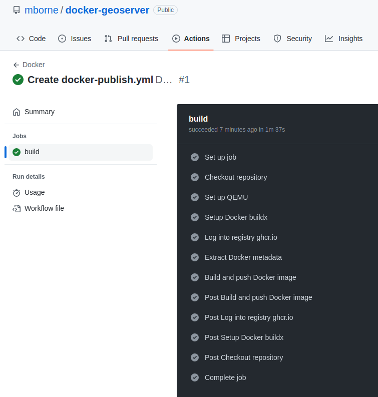

# Intégration continue avec GitHub

## Principe

Le fichier [.github/workflows/docker-publish.yml](../.github/workflows/docker-publish.yml) est configuré pour publier l'image [ghcr.io/mborne/geoserver](https://github.com/mborne/docker-geoserver/pkgs/container/geoserver)

## Résultat

Voir [https://github.com/mborne/docker-geoserver/actions](https://github.com/mborne/docker-geoserver/actions) :

